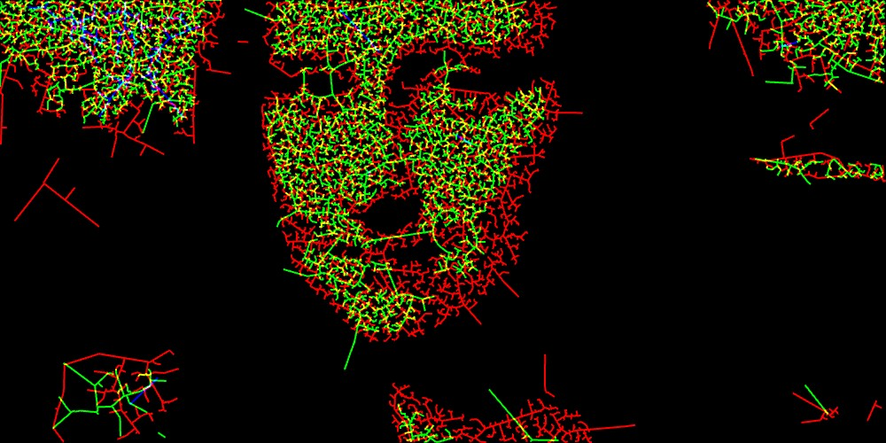
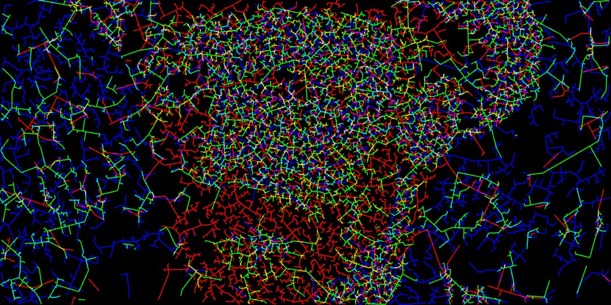
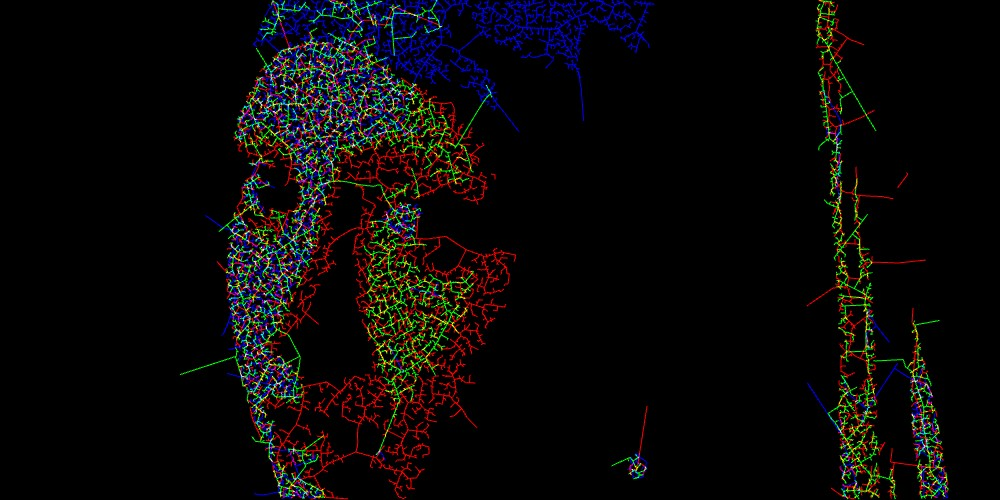

# Drawing a Picture with the Growth Mechanism - RGB Version

Extended to using RGB channels for each node/source combination (instead of brightness), with additive blending to capture the colors in the images as well.

http://www.youtube.com/watch?v=H00gdsPht3I

Final update for me. It has been a rewarding and inspiring experience, to be given the opportunity to exhibit my work alongside people with similar interest, and to use the tools which the community has generously provided for free. I started with Processing when I was a student four years ago, and I remembered just experimenting with sketches put up by the community, and I was always fascinated by how simple algorithms can lead to complex behaviour. 

There are definitely a lot more possibilities, I wished I have spent more time on developing this and I see this as just a start. Hope to go on further to continue exploring, and contribute this project back to the community.